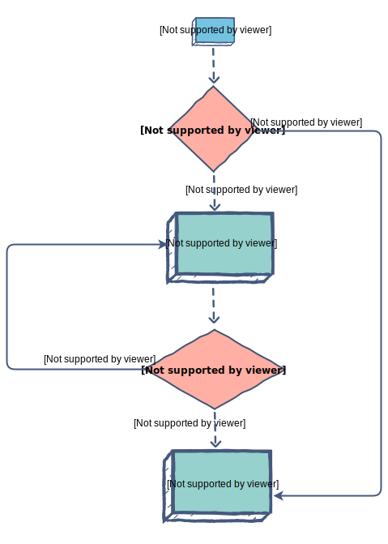

# array.forEach

`forEach` is a method (function) attached to each JavaScript array. The modern
way of looping over each item in an array. Old way is `for` (see that note).

We pass it a function (also called a "callback function").

```js
let groceries = ["rice", "tomato", "broccoli"];
groceries.forEach(groceryItem => {
  console.log(`I LOVE ${groceryItem}`);
})
```

The function is called for each item in the array.

`forEach` always returns `undefined`.

## Callback function can be inline or defined separately

Inline:

```js
let groceries = ["rice", "tomato", "broccoli"];
groceries.forEach(groceryItem => {
  console.log(`I LOVE ${groceryItem}`);
})
```

Separately:

```js
let groceries = ["rice", "tomato", "broccoli"];
const hateThisFood = foodItem => {
  console.log(`I HATE ${foodItem}`);
};
groceries.forEach(hateThisFood);
```

## Print out every item in an array

```js
let groceries = ["rice", "tomato", "broccoli"];
groceries.forEach(groceryItem => {
  console.log(groceryItem);
})
```


